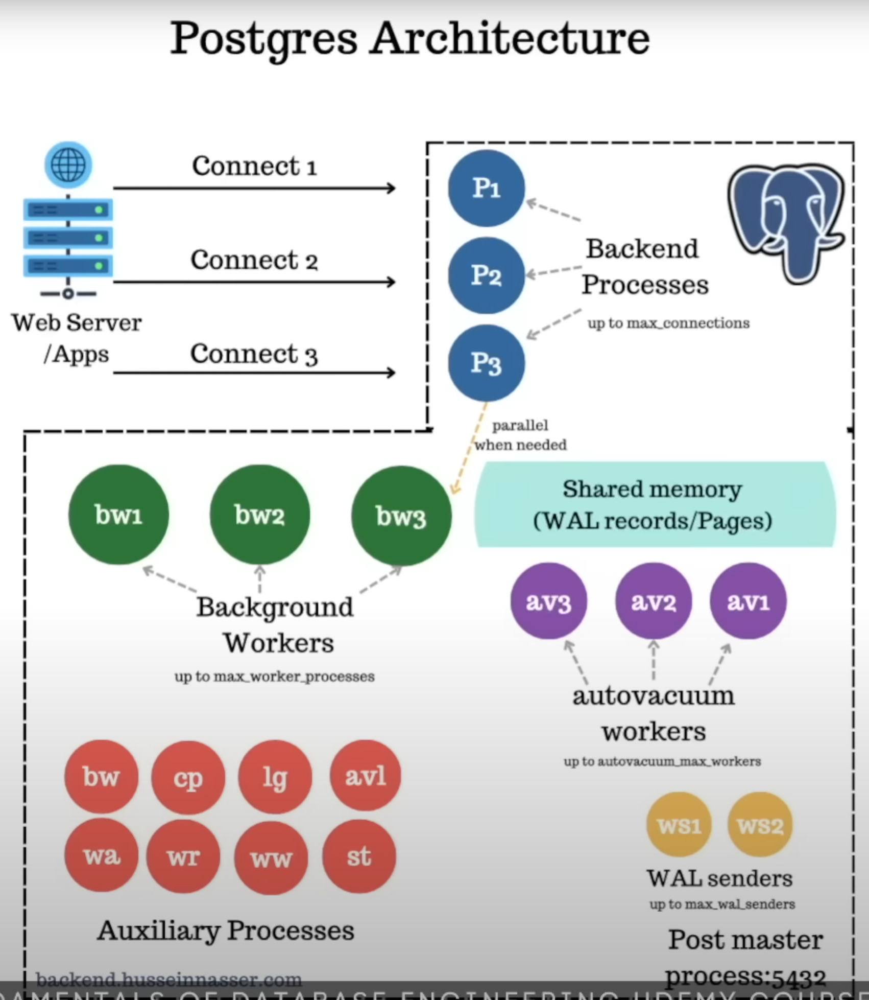

# Database

## PostgreSQL

### Specialties

* Multi-version concurrency control
    * i.e. A row of records is versioned into multiple tuples that are representing the same logical row but in different states/versions. The newest version represents the up-to-date record for that row. Different processes can access a record concurrently.
* Can define custom type
    * ProgreSQL allows users to define custome types/objects in a table schema.

### How It Works Internally

_Study notes from [presentation by Hussein Nasser](https://youtu.be/Q56kljmIN14?si=zSISqnNQNV-7KUJe)._

#### Overview

#### Post Master Process

A parent process that starts at the early stage of the application. Exposes the application to port 5432, such that it's ready for connection.

#### Backend Processes

Each backend process is responsible for maintaining a connection to its consumer.

The number of backend process is capped by the parameter `max_connections`.

#### Background Workers

A background worker is responsible for executing the query or command that a consumer initiated
