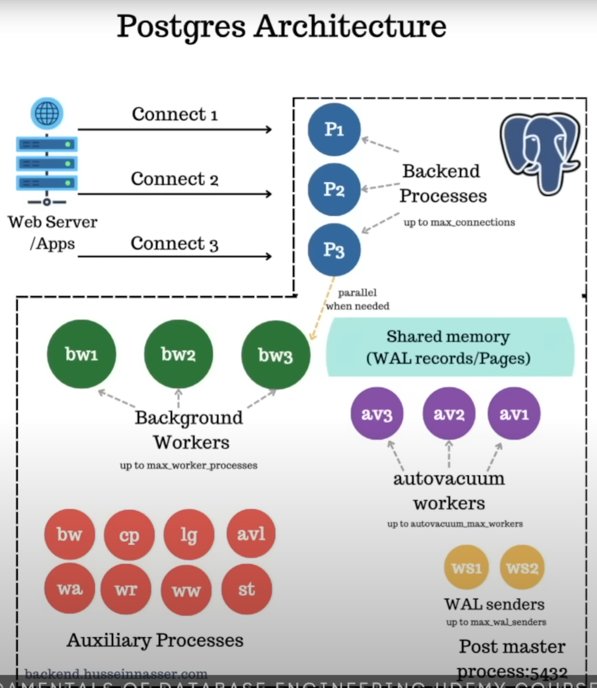

# PostgreSQL

## Specialties

* Multi-version concurrency control
    * i.e. A row of records is versioned into multiple tuples that are representing the same logical row but in different states/versions. The newest version represents the up-to-date record for that row. Different processes can access a record concurrently.
* Can define custom type
    * ProgreSQL allows users to define custome types/objects in a table schema.

## How It Works Internally

_Knowledge collected from [presentation by Hussein Nasser](https://youtu.be/Q56kljmIN14?si=zSISqnNQNV-7KUJe)._

### Overview

### Post Master Process

A parent process that starts at the early stage of the application. Exposes the application to port 5432, such that it's ready for connection.

### Backend Processes

Each backend process is responsible for maintaining a connection to its consumer.

The number of backend process is capped by the parameter `max_connections`.

### Background Workers

A background worker is responsible for executing the query or command that a consumer initiated.

The number of background workers is capped by the parameter `max_worker_processes`.

### Background Writers

A background writer is responsible for flushing the data that is stored in a Page into the filesystem, which will eventually write the data into the disk. It wakes up occasionally to clean up dirty Pages/Shared Memory.

### Checkpointer

Checkpointer is responsible for flushing everything - i.e. both WAL records and Pages to the disk, and creating a checkpoint, indicating that everything now is consistent.

### Logger

Logger is responsible for writing all the logs into the disk.

### Autovacuum Launcher and Workers

Autovacuum worker is responsible for cleaning up the tuples that have older versions and are not being accessed by any of the processes.

The number of autovacuum works is capped by the parameter `autovacuum_max_workers`.

### WAL Archiver

WAL Archiver is responsible for archiving all the WAL records for historical purposes, such that a database can be brought to the newest state from 0 when needed.

### WAL Reciever

WAL Reciever is responsible for recieving WAL records.

### WAL Writer

WAL Writer is responsible for flushing the WAL records into the disk. Each time a commit succeeds, WAL records are flushed into the disk.

### WAL Sender

A WAL Sender is responsible for sending the WAL records to the replicas, from the master instance.

The number of WAL Senders is capped by the parameter `max_val_senders`.

### Startup Process

The Startup Process is responsible for checking the state of the database - i.e. it checks whether the data stored in the Pages are up-to-date with what has been recorded in the WAL records. If the Pages are found out of date, the Startup process will try to re-do what has been recorded in the WAL records, in order to load the up-to-date data into the Pages, before the Post Master Process is started.

